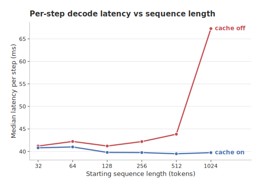
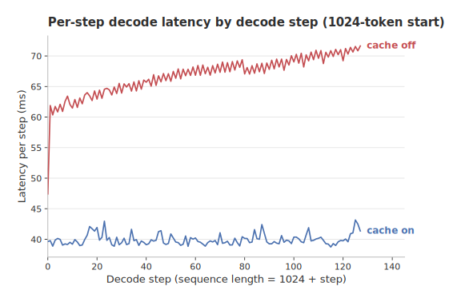
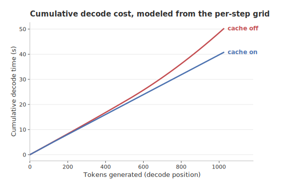
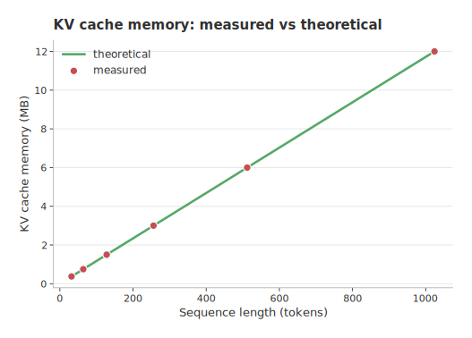
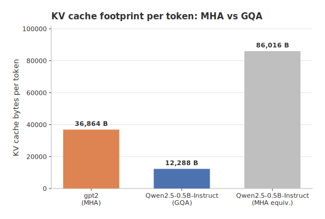

# KV Cache Mechanics

An empirical study of how key-value (KV) caching changes transformer inference,
measured on a small model on a single GPU. It reproduces two textbook results,
decode latency and KV cache memory scaling, and adds a multi-head versus
grouped-query attention comparison.

## Key findings

- **Latency.** With the KV cache on, per-step decode latency stays flat at about
  40 ms regardless of context length. With it off, per-step latency rises 1.63x
  (41.2 ms to 67.3 ms) from 32 to 1024 tokens, so cumulative decode cost grows
  quadratically.
- **Memory.** The KV cache costs 12,288 bytes per token for Qwen2.5-0.5B and
  grows linearly with sequence length, from 0.375 MB at 32 tokens to 12.0 MB at
  1024 tokens, matching the theoretical size exactly.
- **Attention.** Grouped-query attention (GQA) shrinks the KV cache 7.00x
  versus same-dimension multi-head attention (MHA), 12,288 versus 86,016 bytes
  per token, exactly the 14/2 query-to-KV head ratio.

## Table of contents

- [Key findings](#key-findings)
- [Results](#results)
- [Relevance to agent systems](#relevance-to-agent-systems)
- [Method](#method)
- [Reproduction](#reproduction)
- [Project layout](#project-layout)

## Results

### Decode latency vs sequence length

With the cache **on**, each decode step feeds a single new token and reuses the
stored keys and values, so per-step latency is flat (about 40 ms) regardless of
context length. With the cache **off**, every step recomputes attention over the
entire growing sequence, so per-step latency rises with length.



| mode      | per step at L=32 | per step at L=1024 | ratio            |
| --------- | ---------------- | ------------------ | ---------------- |
| cache on  | 40.8 ms          | 39.7 ms            | 0.97x (flat)     |
| cache off | 41.2 ms          | 67.3 ms            | 1.63x (rises)    |

The same rise is visible *within a single decode run*. Holding the start fixed
at 1024 tokens and generating 128 more, the cache-off per-step latency climbs
steadily from about 47 ms to about 72 ms as the re-fed sequence grows, while
cache-on stays flat at about 40 ms. This is the direct measured proof, step by
step (the cache-off curve has step-level jitter but trends clearly upward):



Because the cache-off per-step cost grows with position, the **cumulative** cost
of generating N tokens grows super-linearly (quadratically), while cache-on
cumulative cost is linear:



> **Note: Figure 3 is a modeled curve.** It is not a single recorded run. It
> accumulates the measured per-step latency-vs-length grid (Figure 1) over decode
> positions 1 to 1024, that is, `cumulative(N) = sum of per_step(n) for n <= N`.
> The per-step values are measured; the accumulation is the model. It is shown
> this way because the quadratic only emerges over a large length range, which a
> single 128-step run cannot span.
>
> **Caveat.** On a 0.5B model in eager mode this GPU has a fixed
> per-forward floor of about 40 ms, so the length-dependent compute term only
> dominates at larger contexts. The cache-on versus cache-off contrast and the
> direction of scaling are unambiguous; the absolute curvature is modest at short
> lengths.

### KV cache memory vs sequence length

The cache stores, per layer, a key and a value tensor of shape
`(num_kv_heads, seq_len, head_dim)`. Its theoretical size is:

```text
kv_bytes = 2 * num_layers * num_kv_heads * head_dim * seq_len * dtype_bytes
```

For Qwen2.5-0.5B (24 layers, 2 KV heads, head_dim 64, fp16) that is **12,288
bytes per token**. Measured allocator usage, with the cache held and the model
weights subtracted, matches the theoretical curve exactly and grows linearly:



| sequence length | measured  | theoretical |
| --------------- | --------- | ----------- |
| 32              | 0.375 MB  | 0.375 MB    |
| 512             | 6.000 MB  | 6.000 MB    |
| 1024            | 12.000 MB | 12.000 MB   |

### Attention variants: MHA vs GQA

MHA caches one key and value per attention head. GQA shares each key and value
across a group of query heads, caching only `num_key_value_heads` of them. The
per-token cache therefore shrinks by `num_attention_heads / num_key_value_heads`.



| model        | attention | layers | attn heads | KV heads | bytes/token |
| ------------ | --------- | ------ | ---------- | -------- | ----------- |
| gpt2         | MHA       | 12     | 12         | 12       | 36,864      |
| Qwen2.5-0.5B | GQA       | 24     | 14         | 2        | 12,288      |

Qwen's GQA caches **12,288 bytes per token** versus **86,016 bytes per token**
for an otherwise identical MHA model, a **7.00x reduction**, exactly the 14/2
head ratio.

### Compute and memory tradeoff

The KV cache is a classic space-for-time trade. Without it, generation is
compute-bound and quadratic: producing each new token recomputes attention over
all previous tokens, so total work scales with the square of the sequence
length. With it, the cache trades that quadratic compute for linear compute, at
the cost of a new linear memory term: you store the keys and values of every
past token (12 KB per token here) so each step attends to them instead of
recomputing them. GQA then attacks that new memory term, cutting the per-token
footprint by the head ratio with negligible quality loss, which is why nearly
every modern open-weight model ships with it.

## Relevance to agent systems

This is the mechanical basis for several agent-design rules of thumb. Because the
cache is valid only for a **stable prefix**, the cheapest possible context is one
that is **append-only**: keep the system prompt and tool definitions fixed, add
new turns at the end, and never edit earlier content, since any change
invalidates the cache from that point and forces a full recompute of everything
after it. **Prefix caching economics** follow directly: cached prefix tokens are
billed and computed at a fraction of fresh tokens, so a long, stable shared
prefix across many requests is far cheaper than the same tokens recomputed each
call. Designing agent context for maximal cache reuse, stable prefix first and
volatile content last, is the same linear-versus-quadratic win measured above,
applied at the level of an entire conversation.

## Method

- **Hardware.** NVIDIA RTX 4000 Ada (20 GB), CUDA backend, fp16 weights.
- **Models.** `Qwen/Qwen2.5-0.5B-Instruct` (GQA) for latency and memory; `gpt2`
  (MHA) versus Qwen for the attention-variant comparison.
- **Attention implementation.** `eager` everywhere, chosen for comparability
  across phases rather than raw speed.
- **Manual decode loop, not `model.generate()`.** Cache on retains
  `past_key_values` and feeds one new token per step; cache off re-feeds the
  whole growing sequence and discards the cache. Each step is timed inside
  `torch.cuda.synchronize()` calls, with one discarded warmup and three measured
  repeats aggregated by median.
- **Memory.** `reset_peak_memory_stats()` then `max_memory_allocated()` around a
  held cache, with the model-weights baseline subtracted to isolate the cache.
  Theoretical size uses the formula above.

## Reproduction

The project targets a RunPod PyTorch template where torch with CUDA is already in
the system Python. Do **not** create a virtualenv or reinstall torch.

```bash
# Installs transformers==4.46.3 and the other extras; does not touch torch.
pip install -r requirements.txt

nvidia-smi                               # confirm a GPU is present
python experiments/phase1_smoke.py       # load model, generate, inspect cache
python experiments/phase2_latency.py     # writes results/data/latency.csv, prefill.csv
python experiments/phase3_memory.py      # writes results/data/memory.csv
python experiments/phase4_attention.py   # writes results/data/attention_variants.csv
python experiments/phase5_analysis.py    # writes results/plots/*.svg
pytest                                    # smoke tests
```

> Note: `transformers` is pinned to `4.46.3` because the 5.x series requires a
> newer torch than the pod's 2.4.1.

## Project layout

```text
src/
  config.py              device, models, sequence-length grid, paths, HF_HOME
  model_loader.py        fp16 + CUDA + eager-attention model/tokenizer loader
  memory.py              CUDA peak/current memory helpers
  benchmark.py           manual decode loop (cache on/off) + prefill timing
  attention_variants.py  per-model KV cache shape/byte computation
  plotting.py            the five SVG figures
experiments/             phase1_smoke ... phase5_analysis
results/data/            CSV outputs (gitignored)
results/plots/           SVG figures (committed)
tests/test_smoke.py      CUDA / load / forward-shape assertions
```
